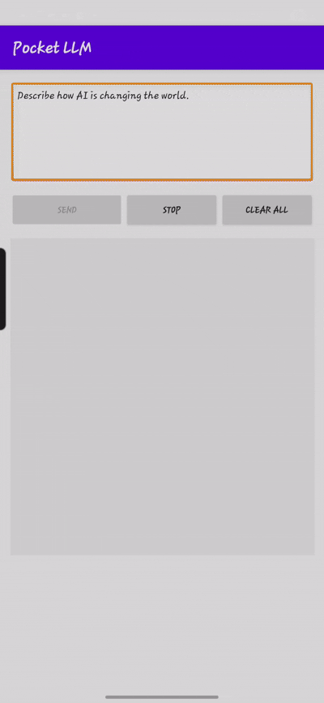
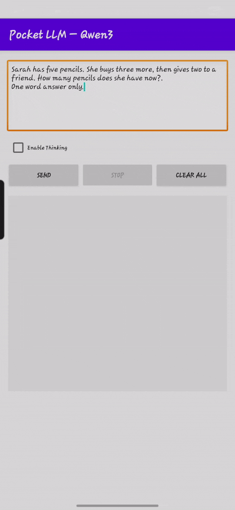

# 🤖 Local LLMs on Android (Offline, Private & Fast)

An Android application that brings local LLM chat to your phone — fully offline, private, and fast.

It supports both **ONNX-based Qwen models** and **Gemma 4 with the LiteRT backend**, with streaming responses, persistent local chat history, manual previous chat reopen, markdown-rendered replies, and a cleaner chat-first UI.

---

## 🆕 New in v1.3.0

- Added **Gemma 4** support with the **LiteRT backend**
- Added persistent local chat history with automatic saving
- Added **Previous Chats** support to reopen and continue older sessions on demand
- Added built-in themes and chat font size settings
- Refreshed the app with a more polished chat-style UI

---

### 🔗 Also Check Out

**[local-document-intelligence](https://github.com/dineshsoudagar/local-document-intelligence)**  
A privacy-first offline document intelligence system with persistent local RAG, hybrid retrieval, and source-grounded answers.

---

## ✨ Features

- 📱 Fully on-device LLM inference for privacy-first offline usage
- 🧠 Supports **Qwen2.5**, **Qwen3**, and **Gemma 4**
- ⚡ **Gemma 4 LiteRT backend** for fast local inference.
- 🔤 Hugging Face compatible BPE tokenizer support for Qwen models.
- 🧩 Custom model configuration for prompt style, precision, KV cache, and backend setup
- 🧘‍♂️ **Thinking Mode** support for **Qwen3**
- 💬 Persistent multi-turn chat with connected conversations
- 🕘 Automatic local saving of chat history
- 📂 Previous Chats support to reopen and continue older sessions on demand
- 🆕 Fresh chat session each time the model loads
- 📝 Markdown rendering for assistant replies
- 🎨 Multiple built-in themes
- 🔠 Adjustable chat font size
- 🛑 Stop-generation support with smoother chat interaction
- 🔐 Runs 100% offline — no network, no telemetry

---

## 📸 Inference Preview

<p align="center">
  
  
  
</p>

<p align="center">
  <em>Figure: App interface showing local LLM chat and streaming responses on Android.</em>
</p>

---

## 🧠 Model Support

This app supports both **ONNX-based Qwen models** and **Gemma 4 via LiteRT**.

### Supported models

- **Qwen2.5-0.5B-Instruct**
- **Qwen3-0.6B**
- **Gemma 4 E2B** via `.litertlm`

### Backend overview

- **Qwen2.5 / Qwen3** run through the ONNX backend
- **Gemma 4** runs through the LiteRT backend

### Qwen model files

For Qwen models, the app expects:

- `model.onnx`
- `tokenizer.json`

### Gemma model files

For Gemma 4, the app expects:

- `gemma-4-E2B-it.litertlm`

### Thinking Mode

- **Qwen3** supports **Thinking Mode**
- **Gemma 4** does not use Thinking Mode in this app, so the toggle is hidden

---

## 🚀 Why Gemma 4 + LiteRT is a strong fit for this app

**Gemma 4 E2B** is one of the most practical current choices for fast local Android chat because:

- it is part of Gemma 4’s small-size family built for **ultra-mobile and edge deployment**
- Gemma 4 is provided with **open weights** and supports **responsible commercial use**
- the Gemma 4 family brings strong general-purpose capability for **generation, summarization, reasoning, and multilingual use**
- LiteRT-LM is designed specifically for **high-performance on-device LLM deployment**
- LiteRT-LM supports **hardware acceleration**, including **GPU and NPU acceleration** on supported devices

In Google’s official LiteRT-LM showcase for **Gemma-4-E2B** on Android, GPU execution achieved much faster startup than CPU execution, including about **0.3 s time-to-first-token on GPU vs 1.8 s on CPU** on the referenced device. That lines up with the kind of fast chat experience this app is aiming for.

> Note: this app currently uses Gemma 4 for **text chat**. The wider Gemma 4 family also supports multimodal capabilities, but those are not exposed in this app yet.

---

## ⚙️ Requirements

- [Android Studio](https://developer.android.com/studio)
- [ONNX Runtime for Android](https://github.com/microsoft/onnxruntime-genai/releases) for Qwen builds
- LiteRT dependencies for Gemma builds
- A physical Android device for deployment and testing
- ≥ 4 GB RAM for FP16 / Q4 models
- ≥ 6 GB RAM for FP32 models
- Real hardware is preferred — emulators are mainly useful for UI checks

---

## 🔁 Choose Which Model to Build With

The active model is selected in:

`app/src/main/java/com/example/local_llm/ModelDescriptor.kt`

Inside `ModelRegistry`, change:

```kotlin
private const val SELECTED_MODEL_ID = "gemma4_e2b"
```

to one of:

```kotlin
"qwen2_5"      // Qwen2.5
"qwen3"        // Qwen3
"gemma4_e2b"   // Gemma 4
```

### Notes

- The app title uses the selected model display name
- **Thinking Mode** is available for **Qwen3**
- **Gemma 4** is displayed as **Gemma4** in the UI

---

## 🔁 Get or Convert Models

### Option 1: Use preconverted ONNX Qwen models

Download the ONNX model files from Hugging Face:

- 🔹 [Qwen2.5](https://huggingface.co/onnx-community/Qwen2.5-0.5B-Instruct)
- 🔹 [Qwen3](https://huggingface.co/onnx-community/Qwen3-0.6B-ONNX)

### Option 2: Use Gemma 4 with LiteRT

Use the Gemma 4 E2B LiteRT model file:

- 🔹 `gemma-4-E2B-it.litertlm`

### Option 3: Convert a Qwen model yourself

```bash
pip install optimum[onnxruntime]
# or
python -m pip install git+https://github.com/huggingface/optimum.git
```

Export the model:

```bash
optimum-cli export onnx --model Qwen/Qwen2.5-0.5B-Instruct qwen2.5-0.5B-onnx/
```

You can also convert a fine-tuned Qwen variant by pointing Optimum to your model path.

---

## 🚀 How to Build & Run

1. Clone this repository.
2. Install the latest **Android Studio**.
3. Open the Android source folder in Android Studio:

   ```text
     Pocket_LLM_src/
    ```
4. Place the required model assets in:

   ```text
   app/src/main/assets/
   ```

   You can place `model.onnx` and `tokenizer.json` directly in that folder or inside a single nested model folder.

5. Add the files that match the model you selected:

   **For Qwen2.5 / Qwen3**
   - `model.onnx`
   - `tokenizer.json`

   **For Gemma 4**
   - `gemma-4-E2B-it.litertlm`

6. In `ModelDescriptor.kt`, set the active model using `SELECTED_MODEL_ID`.
7. Connect your Android phone using USB or wireless debugging.
8. Run the app from Android Studio, or generate a signed APK from:

   **Build → Generate Signed Bundle / APK**

9. Once installed, look for the **Pocket LLM** icon on your device.

**Note**: All Kotlin files are declared in the package `com.example.local_llm`, and the Gradle script uses the same application id.  
If you rename the app or package, you must also refactor the package declarations, folder structure, and Gradle application id.

---

## 📦 Download Prebuilt APKs

### v1.3.0

- ➡️ `pocket_llm_gemma4_e2b_v1.3.0.apk`  
  Gemma 4 with LiteRT backend and the new chat-style UI

- ➡️ `pocket_llm_qwen2.5_0.5B_v1.3.0.apk`  
  Updated Qwen2.5 build with the new UI and persistent chat support

- ➡️ `pocket_llm_qwen2.5_0.5B_fp16_v1.3.0.apk`  
  FP16 Qwen2.5 build with the refreshed UI and connected chat flow

- ➡️ `pocket_llm_qwen2.5_0.5B_q4fp16_v1.3.0.apk`  
  Quantized Qwen2.5 build with the refreshed UI and connected chat flow

- ➡️ `pocket_llm_qwen3_0.6B_fp16_v1.3.0.apk`  
  Qwen3 build with Thinking Mode support and the new persistent chat UI

- ➡️ `pocket_llm_qwen3_0.6B_q4fp16_v1.3.0.apk`  
  Compact Qwen3 build with Thinking Mode support and the new UI

---

## Customize Your App Experience

- Define the assistant’s tone and role using the model’s default system prompt
- Adjust `TEMPERATURE` to control response randomness
- Adjust `REPETITION_PENALTY` to reduce repetitive output
- Change `MAX_TOKENS` to control reply length
- Use built-in themes for a different look and feel
- Adjust chat font size from the Settings screen

---

## 📄 License Notice

### Gemma 4

Gemma 4 is provided by Google under the **Apache License 2.0**. Google’s Gemma documentation also states that Gemma models are provided with open weights and support responsible commercial use.

- Gemma 4 license: https://ai.google.dev/gemma/apache_2
- Gemma 4 overview: https://ai.google.dev/gemma/docs/core

### Qwen models

Qwen-based ONNX models follow the upstream Qwen license terms.  
Please review the original model license before redistribution or commercial usage.
