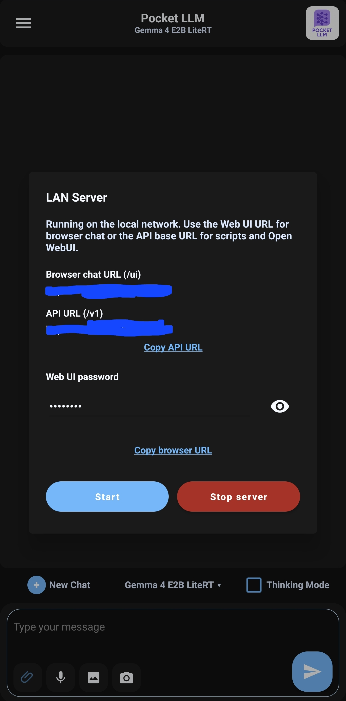

# 🤖 Pocket LLM for Android (Local LLM Server, Offline & Private)

Turn your Android phone into a **local LLM server for your home network**, or chat privately on-device with text, images, PDFs, audio, and offline speech-to-text.

Chat in the app, open its Web UI on your computer, or connect a compatible OpenAI client while the model runs on your phone.

🏠 [Watch the LAN demo](#lan-server-demo) or [connect scripts and scheduled workflows](docs/lan/README.md).

Install the small base APK, then download a built-in model or import your own LiteRT model (beta).

---

[](https://github.com/dineshsoudagar/local-llms-on-android/releases)

---

## 🆕 New in v1.6.0

Changes since v1.5.0:

### New features

#### 🏠 Make your phone a local LLM server

Run the model on your phone and use it from other devices on your home network; [see the demo](#lan-server-demo) or [client guide](docs/lan/README.md).

- 🌐 **[LAN and browser chat](#lan-api-and-web-ui):** Open the phone's password-protected Web UI on your PC while inference stays on the phone.
- 🗂️ **[Browser history and uploads](#browser-web-ui):** Save, reopen, or delete chats on the phone, and upload PDFs or images from your PC.
- 🔌 **[OpenAI-compatible API](docs/lan/README.md#openai-compatible-endpoints):** Connect Open WebUI, [example scripts](docs/lan/README.md#python-client), or compatible harnesses; [OpenCode](docs/lan/README.md#opencode-coding-agent-backend) tool-call round trips tested.
- ⚙️ **[Context settings](#context-length-setting):** Adjust context length per LiteRT model.

#### 🧩 Models, documents and voice

- 🧩 **[Your own model (beta)](#use-your-own-model-beta):** Import a local `.litertlm` file for text chat, with native image and audio input attempted when supported.
- 📄 **[Documents](#document-and-audio-attachments):** Attach text files and PDFs, including scanned pages read with OCR.
- 🔎 **[Document answers](#document-and-audio-attachments):** Use simple BM25 retrieval for questions or process all source chunks for summaries.
- 🎙️ **[Speech-to-text](#document-and-audio-attachments):** Transcribe offline with multilingual Whisper, including German, and edit before sending.
- 🔊 **[Audio attachments](#document-and-audio-attachments):** Upload or record audio for native understanding on compatible models or Whisper transcription.

### Improvements

- ⏳ **Long inputs:** Added segmented audio processing and cancellable attachment jobs with progress.
- 🎨 **Browser controls:** Added light/dark themes, Enter to send, and Shift+Enter for a new line.
- ⚡ **Runtime:** Updated and pinned LiteRT-LM to **0.17.1**.

### Fixes and cleanup

- 🛡️ **Model loading:** Improved file validation, downloads, cancellation, and recovery after failed initialization.
- 🖼️ **Image input:** Removed FastVLM descriptions; images now use OCR or native Gemma vision.

### Limitations and next steps

- 🧩 **Custom models:** Beta compatibility varies by model and phone; native tool calling is unavailable.
- ⚠️ **Memory:** Large models and contexts can still fail to load or crash, including during long OpenCode sessions.
- 🖼️ **Browser images:** Direct image uploads require a compatible model.
- 🚀 **Coming next:** Improved document retrieval; this release uses lightweight BM25.

#### ➡️ [See all releases](https://github.com/dineshsoudagar/local-llms-on-android/releases)

---

## 📸 Inference Preview

<table align="center">
  <tr>
    <td align="center">
      <br/>
      <sub><b>Chat Inference</b></sub>
    </td>
    <td align="center">
      <br/>
      <sub><b>Image Support</b></sub>
    </td>
    <td align="center">
      <br/>
      <sub><b>New UI</b></sub>
    </td>
  </tr>
</table>

<p align="center">
  <em>Figure: Pocket LLM showing offline chat, image input, and the updated Android UI.</em>
</p>

---

## ✨ Features

### Chat and privacy

- 📱 **Local inference:** Run models on your phone with ONNX or LiteRT, offline after installation.
- 💬 **Chat:** Stream replies, keep multi-turn history, render Markdown, and copy responses.
- 🗂️ **History:** Reopen or delete saved conversations in the Android app or browser.
- 🎨 **Appearance:** Choose light/dark mode, accent colors, and chat font size in the Android app.
- 🔐 **Privacy:** Keep inference and chat data on your phone, with no telemetry.

### Models and settings

- 🧠 **Built-in models:** Choose Qwen2.5, Qwen3, DeepSeek R1 Distill Qwen, or Gemma 4.
- 📦 **Model management:** Download, switch, and delete models inside the app.
- 🧩 **Custom models (beta):** Import your own `.litertlm` model from device storage; native image and audio availability depend on the model and device backend.
- 💭 **Thinking mode:** Toggle reasoning on supported Qwen3 and Gemma models.
- 🎛️ **Instructions:** Edit model instructions or choose a prompt preset.
- ⚙️ **Context length:** Set each LiteRT model's context size to balance history and memory use.
- 🛡️ **Recovery:** Validate model files and recover from interrupted loading without losing saved chats.

### Files and voice

- 🎙️ **Dictation:** Turn recordings into editable text with offline multilingual Whisper, including German.
- 🔊 **Audio:** Use native audio understanding on compatible Gemma or imported models, or Whisper transcription when native audio is unavailable.
- 📄 **Documents:** Attach text files and PDFs, including scanned PDFs read with OCR.
- 🔎 **Retrieval:** Ask document questions with BM25 or summarize source chunks within the context budget.
- 📎 **References:** Keep document, page, or timestamp references with the owning chat.
- ⏳ **Progress:** Track or cancel long document extraction and audio transcription jobs.
- 🖼️ **Images:** Extract text with OCR or send images directly to compatible Gemma or imported models.
- 📷 **Camera:** Capture, retake, crop, review, and send photos.

### LAN and integrations

- 🌐 **LAN server:** Serve the phone's selected model to devices on the same private network.
- 🏠 **Local AI home server:** Use built-in or compatible imported LiteRT models as a shared inference endpoint for scheduled jobs and monitoring workflows.
- 💻 **Web UI:** Chat in a PC browser, upload PDFs or images, and save conversations on the phone.
- 🔌 **[OpenAI-compatible API](docs/lan/README.md#openai-compatible-endpoints):** Connect compatible clients through model and chat-completion endpoints.
- 🛠️ **[Agent tools](docs/lan/README.md#opencode-coding-agent-backend):** Return native tool calls from supported LiteRT models for harnesses such as OpenCode to execute.

---

## LAN server demo

<table align="center" width="100%">
  <tr>
    <td align="center" valign="top" width="22%">
      <br/>
      <sub><b>Start the server on your phone</b></sub>
    </td>
    <td align="center" valign="top" width="78%">
      <video src="data/pocket_llm_v1.6_lan_server_demo.mp4" width="600" height="338" controls preload="metadata" aria-label="Pocket LLM LAN browser chat demonstration">
        <a href="data/pocket_llm_v1.6_lan_server_demo.mp4">Watch the LAN server demo</a>
      </video><br/>
      <sub><b>Use the model from your browser</b> · <a href="data/pocket_llm_v1.6_lan_server_demo.mp4">Watch / download video</a></sub>
    </td>
  </tr>
</table>

---

## 📦 Download APK - v1.6.0

The app ships as a **single smaller base APK**.

#### ➡️ [Download APK](https://github.com/dineshsoudagar/local-llms-on-android/releases/download/v1.6.0/pocket_llm_v1.6.0.apk)

Models are **not bundled inside the APK**. After installation, choose and download the models you want directly on device.

You can download **multiple models**, switch between them inside the app, and delete unused downloaded models later to free storage.

### Available chat models

- **Gemma 4 E4B LiteRT** - Best for **flagship mobiles**
- **Gemma 4 E2B LiteRT** - Best for **decent to mid-range mobiles**
- **DeepSeek R1 Distill Qwen 1.5B LiteRT** - Optional reasoning model for **high-RAM mobiles**
- **Qwen3 0.6B LiteRT** - Best for **low-end mobiles**
- **Qwen3 0.6B Q4F16 ONNX** - Good for **low to mid-range mobiles**
- **Qwen2.5 0.5B ONNX** - Best for **mid to high-end mobiles**, **full precision**

### Use your own model (beta)

- Open **Manage Models → use your own model (beta)** and choose a local `.litertlm` file.
- The app copies the file into private storage and adds it to the model picker.
- The app detects declared inputs and attempts native image and audio support when available. The ready message reports availability on the current device/backend; declared support is not a compatibility guarantee.
- Text chat is required. Images can use OCR or **Native image input** when available; audio uses native input when available or optional Whisper transcription otherwise.
- Video input, generated audio, and custom thinking controls are not enabled. See the [custom-model beta guide](CUSTOM_MODEL_BETA.md) for details and device checks.
- Custom models do not expose native tool calling through the LAN API.
- Custom-model compatibility is experimental; larger models or contexts may fail to load or crash.

### Image input support

- **OCR mode** - Extract text from images
- **Native image input** - Send images directly to compatible Gemma or imported models
- **Camera capture** - Take a photo, retake, crop, review, and send it as input

> Note: internet is required only for downloading models. Chat, OCR, image input, camera workflows, and inference remain fully on-device after the required models are installed.

## Document and audio attachments

- **Text:** Attach UTF-8 or UTF-16 text files up to 16 MiB.
- **PDFs:** Attach embedded-text or scanned PDFs up to 64 MiB and 500 pages in the Android app.
- **PDF OCR:** Extract embedded text first and use on-device OCR only for pages that need it.
- **Questions:** Use lightweight BM25 to select relevant passages that fit the model context.
- **Summaries:** Process all source chunks for summaries and ordered transformations.
- **References:** Prompt answers to retain page, section, or timestamp markers.
- **Audio files:** Attach Android-decodable audio up to 512 MiB and two hours, or record audio in-app.
- **Native audio:** Use compatible Gemma or imported models for native audio understanding, with overlapping segments for longer recordings. Imported models use segments of at most 10 seconds.
- **Whisper fallback:** When native audio is unavailable, transcribe with multilingual Whisper tiny int8 after a separate download of about 100 MB.
- **Dictation:** Tap the microphone, record, transcribe, and edit the recognized text before sending.
- **Attachment limits:** Keep one active document or audio source per Android chat; do not mix it with images in one send.
- **Storage:** Detaching keeps the source data; deleting its chat removes it from private app storage.
- **Progress:** Long extraction and transcription jobs show progress and can be cancelled.

---

## LAN API and Web UI

1. Load a model, open **LAN Server** in the Android app, enter a password of at least eight characters, and tap **Save password**.
2. Tap **Start**, then open the displayed `/ui` URL on a computer on the same Wi-Fi or LAN.
3. For API clients, use `http://PHONE_IP:8080/v1` and the same password.

### Browser Web UI

- Save, reopen, and delete browser conversations stored privately on the phone.
- Upload PDFs or images; direct images require a compatible model.
- Switch light/dark themes; use Enter to send and Shift+Enter for a new line.
- Stop the LAN server before changing the model or password.

📖 **[Client setup and examples](docs/lan/README.md):** Python, HTTP scripts, PowerShell, OpenCode, Open WebUI, and automation.

### Context-length setting

LiteRT models expose a context-length field in the Android app's model settings. This is a device-memory trade-off: a larger context can require substantially more native and GPU memory.

- **Recommended tested baseline:** 8K tokens.
- **Limited manual testing:** 10K to 15K worked on the tested device, but this is not broad device validation.
- **Configurable maximum:** Qwen LiteRT models allow up to 40K and Gemma LiteRT models up to 128K. Those values are configuration ceilings, not guarantees that a phone can initialize or run safely at that size.

The app warns above 8K. A native LiteRT-LM crash was observed with Gemma 4 E2B at 20K on a tested device, consistent with high-context memory pressure. Keep the context near 8K unless you have tested the selected model on your own device.

## 🧠 Backend Support

This app supports **ONNX-based Qwen models** and **LiteRT-based Qwen 3 and Gemma 4 models**.

### Backend overview

- **ONNX backend**: supports **Qwen2.5** and **Qwen3**
- **LiteRT backend**: supports **Qwen3**, **DeepSeek R1 Distill Qwen**, **Gemma 4**, and imported `.litertlm` models (beta), with native image/audio input when available

### Thinking Mode

- **Qwen3** and **Gemma 4** support **Thinking Mode**
- The toggle is shown only for models that support it

---

## 🚀 Why LiteRT

**LiteRT** is a strong fit for fast local Android chat because:

- It is designed for **high-performance on-device LLM deployment**
- It supports **hardware acceleration**, including **GPU and NPU acceleration** on supported devices
- It helps reduce startup and generation latency for local chat workloads
- It expands the range of practical Android model builds beyond a single backend path
- It fits well with a privacy-first app design focused on fully offline usage

> Note: model capability and performance still depend on the specific model build and the hardware of the target Android device.

---

## ⚙️ Requirements

- [Android Studio](https://developer.android.com/studio)
- A physical Android device for deployment and testing
- 4 GB or more RAM for smaller models
- More RAM is recommended for larger models such as **Gemma 4 E2B** and **Gemma 4 E4B**
- A temporary internet connection for downloading models inside the app
- Real hardware is preferred; emulators are mainly useful for UI checks

### Safe model loading and recovery

Before a model is loaded, Pocket LLM checks available storage and validates the downloaded files. Memory estimates are advisory only: they do not block loading or require confirmation because device memory reports cannot reliably predict LiteRT backend compatibility. The app automatically attempts initialization with the available backend fallbacks.

The app records when initialization starts and clears that record only after the model is ready. If initialization fails or the app stops during loading, the same model is not retried automatically on the next launch. A recovery prompt lets you choose another model, delete the failed files, retry manually, or continue without a loaded model. Saved chat history is kept independently and is not deleted by model-load recovery.

---

## 🚀 How to Build & Run

1. Clone this repository.
2. Install the latest **Android Studio**.
3. Open the Android project folder in Android Studio:

    ```text
    pocket_llm_src/
    ```
4. Build and install the app on your Android device.
5. Launch the app.
6. On first launch, choose a model from the built-in model picker.
7. Download the selected model directly inside the app.
8. Start chatting locally on device

---

### 🔗 Also Check Out

**[local-document-intelligence](https://github.com/dineshsoudagar/local-document-intelligence)**
A privacy-first offline document intelligence system with persistent local RAG, hybrid retrieval, and source-grounded answers.

---

## 📄 License Notice

### Gemma 4

Gemma 4 is provided by Google under the **Apache License 2.0**. Google's Gemma documentation also states that Gemma models are provided with open weights and support responsible commercial use.

- Gemma 4 license: https://ai.google.dev/gemma/apache_2
- Gemma 4 overview: https://ai.google.dev/gemma/docs/core

### Qwen models

Qwen model files follow the upstream Qwen license terms.  
Please review the original model license before redistribution or commercial use.
